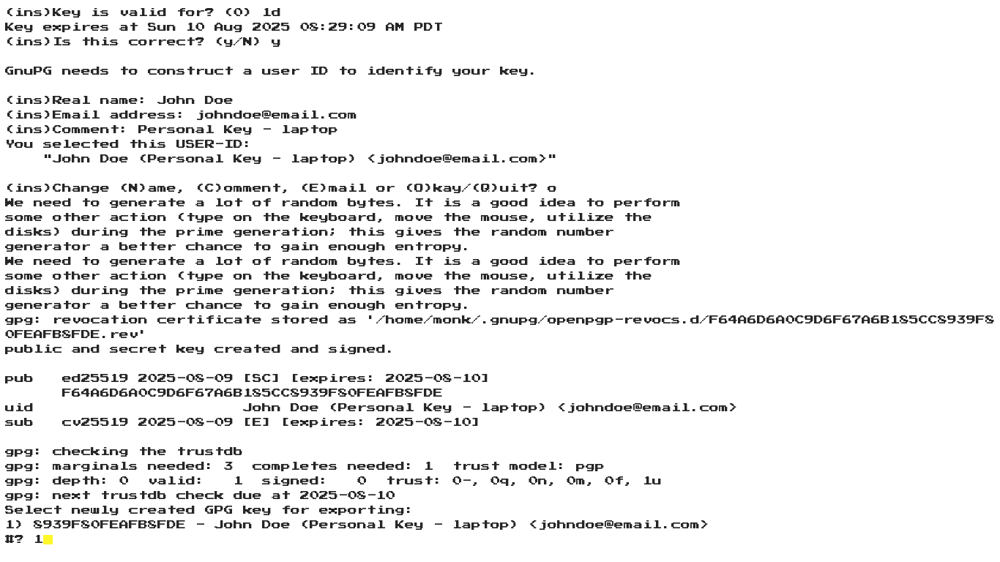

## I use this all the time, and I think you will too!  Simply add the file into ~/.local/bin and you will be able to use it wherever by typing gpgcli within your terminal!

```bash
$ gpgcli
```

```bash
Choose GPG key:

1) 075ACC01BF2A8268 - Brian Spragge (Personal Key - Laptop) <brianspragge@gmail.com>
2) Create key
3) Exit
#? 
```

```bash
Smell ya later!
```

# PREVIEW




